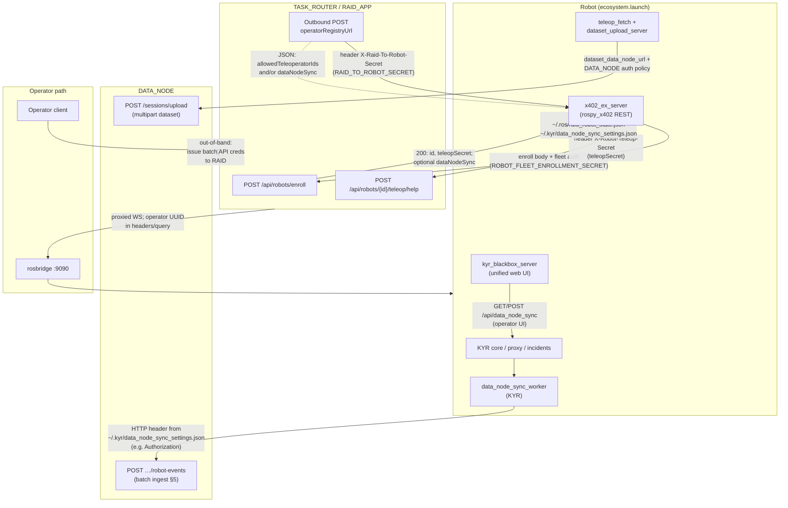

# Robot stack — connections and authentication (reference)

**Temporary handout** under `br_bringup/TEMP/`. Source of truth remains the linked repositories (`br-kyr`, `rospy_x402`, `br-vr-dev-sinc`).

## Mermaid — components and auth

## Legend (short)

| Edge | Meaning |
|------|---------|
| Robot → RAID enroll | One-time or idempotent registration; fleet secret proves robot fleet membership. |
| RAID → Robot push | RAID initiates; shared secret `RAID_TO_ROBOT_SECRET` proves caller is RAID. |
| Robot → RAID `teleop/help` | `teleopSecret` proves this robot instance matches enroll record. |
| Robot → DATA_NODE batch | URL/token normally **provisioned by RAID** into `data_node_sync_settings.json` (`dataNodeSync`). |
| Robot → DATA_NODE upload | Usually **launch/config** (`dataset_data_node_url`); not the same mechanism as batch unless you align them in ops. |
| DATA_NODE → RAID (dashed) | **Product/ops**: DATA_NODE gives RAID ingest credentials; not a single normative HTTP step on the robot. |

## Bundles in this folder

- `DATA_NODE_FULL_SINC/` — specs for DATA_NODE developers (ingest, sessions, HBR, correlation).
- `TASK_ROUTER_FULL_SINC/` — specs for RAID / task-router developers (enroll, push, teleop/help, x402 grant flow, batch provisioning contract).
