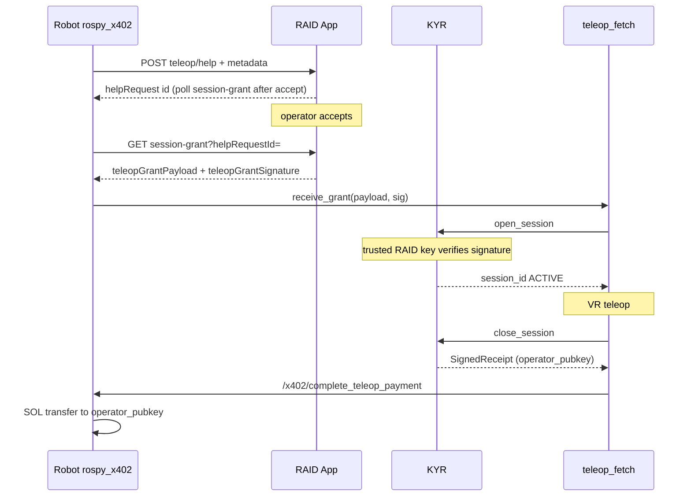

# RAID App — full teleop cycle: `teleop/help`, SessionGrant, operator wallet, post-session SOL payment (x402)

**Audience:** Task-router-x402 team (`task-router-x402` repository or equivalent), product and backend.  
**Robot:** `rospy_x402` package (`EscalationManager`, `x402_ex_server` node).  
**Robot developer (step order, KYR, `pending_from_raid`):** [ROBOT_TELEOP_KYR_RAID_GRANT.md](ROBOT_TELEOP_KYR_RAID_GRANT.md).  
**Related:** [RAID_APP_TELEOP_HELP_SPEC.md](RAID_APP_TELEOP_HELP_SPEC.md) (request body), [RAID_INTEGRATION.md](RAID_INTEGRATION.md), [../br-kyr/DOC/ROSBRIDGE_AND_RAID.md](../../br-kyr/DOC/ROSBRIDGE_AND_RAID.md).

## Goal

Close the loop:

1. Robot requests help **only** via RAID: `POST /api/robots/{robotId}/teleop/help` (already implemented).
2. RAID assigns an operator who already has a **public Solana key** in your DB for payouts.
3. RAID returns a **signed SessionGrant** (KYR) whose JSON includes `operator_pubkey` — same Solana base58.
4. After the session KYR closes and puts the same `operator_pubkey` in **SignedReceipt**.
5. Robot transfers SOL to the operator using the **same wallet stack** as `x402_buy_service` (outgoing `X402Client.send_payment`), ROS service `/x402/complete_teleop_payment`.

RAID **does not** have to implement on-chain Solana logic: correct grant + pubkey is enough; the robot signs the transaction.

---

## 1. Request (base contract unchanged)

See [RAID_APP_TELEOP_HELP_SPEC.md](RAID_APP_TELEOP_HELP_SPEC.md): `message`, `metadata.task_id`, `error_context`, `situation_report`, optional `kyr_peaq_context`.

---

## 2. RAID response: request id + signed grant

HTTP **200** or **201**; **401** on bad secret.

### 2.1 Fields required for the full cycle

Robot looks for the grant at JSON root or inside `helpRequest` / `help_request` (nested object merged with root for field lookup).

**Option A (preferred): ready signature string**

| Field | Type | Description |
|-------|------|-------------|
| `teleopGrantPayload` | string | Exact UTF-8 JSON **SessionGrant** string, byte-for-byte as signed. Robot passes to KYR without re-serializing. |
| `teleopGrantSignature` | string | Ed25519 signature **base58** over **raw UTF-8 bytes** of `teleopGrantPayload`. |

**Key synonyms (robot accepts any):**

- payload: `teleopGrantPayload`, `grantPayload`, `sessionGrantPayload`
- signature: `teleopGrantSignature`, `grantSignature`, `sessionGrantSignature`

**Option B: object + signature**

| Field | Type | Description |
|-------|------|-------------|
| `sessionGrant` (or `session_grant`) | object | SessionGrant object (see §3). |
| One of the signature keys above | string | Signature over **canonical** JSON: `json.dumps(obj, sort_keys=True, separators=(',', ':'))`, UTF-8, Unicode as `ensure_ascii=False`. |

Option B is worse for compatibility: any serialization mismatch breaks KYR verification. Option A is safer.

### 2.2 Compatibility with legacy robots

If there is no signed grant, the robot stays on **fallback**: local mock SessionGrant and `operator_pubkey: "pending_from_raid"` — operator payment is skipped until a real pubkey appears in the receipt.

### 2.3 Recommended extra fields

- `id` or `helpRequest.id` — as today, for Peaq claim and tracking.
- `duplicate: true` when the same open request is posted again — as today.

### 2.4 When the operator is assigned (RAID App behavior)

In current RAID the operator is fixed only after **`POST /api/teleoperator/help-requests/{id}/accept`**. So the **signed grant** is **not** in the first **`POST …/teleop/help`** response: the robot polls **`GET /api/robots/{robotId}/teleop/session-grant?helpRequestId=`** (same **`X-Robot-Teleop-Secret`**) until **`teleopGrantPayload`** / **`teleopGrantSignature`**, or stays on §2.2 fallback while the request is open or signing is unconfigured.

In **`scope_json`** RAID may add a flat payment hint: **`teleop_payment_mode`**: **`flat`**, **`teleop_operator_flat_sol`** (default **0.0005**, env **`TELEOP_OPERATOR_FLAT_SOL`**) so the node can align amount with **`/x402/complete_teleop_payment`** beyond per-second rosparam.

---

## 3. SessionGrant schema (JSON inside `teleopGrantPayload`)

Fields KYR expects (`session_module.open_session`):

| Field | Type | Description |
|-------|------|-------------|
| `session_id` | string | Unique session id (UUID or help request id). |
| `robot_id` | string | Robot UUID from enroll (as in robot `raid_robot_state.json`). |
| `task_id` | string | Copy/link to `metadata.task_id` from the help request. |
| `operator_pubkey` | string | **Solana public key base58** for the operator who receives SOL. Must match your DB. |
| `valid_until_sec` | number | Grant expiry Unix time. |
| `scope_json` | string | JSON string policy, e.g. `{"allowed_actions":["*"]}`. |

The grant is signed by a **RAID key (Ed25519)**, not the operator wallet. KYR must list the issuer pubkey in `trusted_raid_keys` on the robot.

**Important:** `operator_pubkey` is the SOL recipient; the grant signing key is a separate RAID trust key.

---

## 4. Post-payment on the robot (for RAID / support context)

After `POST …/teleop/help` and KYR session start, the operator uses the existing teleop pipeline. On session end:

1. `teleop_fetch` calls KYR `close_session`.
2. ROS service **`/x402/complete_teleop_payment`** is called with `receipt_payload` from KYR.
3. Node computes amount: `(ended_at_sec - started_at_sec) * teleop_operator_payment_sol_per_sec` (rosparam, default `1e-6` SOL/s for tests).
4. Outgoing SOL transfer to `operator_pubkey` from receipt (same stack as `x402_buy_service` with `payer_account`).

RAID may later accept a payment notification from the robot (separate endpoint — outside current mandatory contract); robot code may have a commented example `POST …/receipt`.

---

## 5. Flow (short)



---

## 6. RAID checklist

0. Set **`TELEOP_GRANT_SIGNING_SECRET_KEY`** in RAID (separate Solana keypair for grant signing; not the robot payer wallet). Else **`GET …/teleop/session-grant`** returns **`grant_unconfigured`** and the robot stays on mock grant.
1. Store and inject operator **Solana base58** from DB into the grant.
2. Issue a **signed** grant (option A or B).
3. Publish the grant signer **Ed25519 public key** for KYR `trusted_raid_keys` (in prod use **`GET /health`** → **`teleopGrantSignerPublicKey`**).
4. Persist `situation_report` and request context for the operator UI/API ([RAID_APP_TELEOP_HELP_SPEC.md](RAID_APP_TELEOP_HELP_SPEC.md)).

After RAID implements this, the robot can stop using the mock grant for these flows and pay the operator in SOL when the session ends.

---

## 7. Troubleshooting: `pending_from_raid` in receipt / “NO on-chain transfer”

Messages like **`No valid operator Solana pubkey in receipt`** / **`pending_from_raid`** mean **KYR did not record a real `operator_pubkey` from RAID’s signed grant** in **SignedReceipt**. It **does not** mean RAID sends stale data in `POST …/teleop/help`: that response has no grant yet (no operator).

**Typical causes:**

1. **Step order on robot:** KYR `open_session` ran with a **mock grant** before the robot finished **`GET …/teleop/session-grant`** after operator **accept**. Fix: after accept (or polling) obtain **`teleopGrantPayload`** + **`teleopGrantSignature`**, pass them to KYR **`open_session`**, then teleop.
2. **Grant signature not trusted on KYR:** RAID signer pubkey must be in **`trusted_raid_keys`** on the robot. Compare **`GET /health`** on RAID → **`teleopGrantSignerPublicKey`**, or **`grantSignerPublicKey`** in **`GET …/teleop/session-grant`**. Without this KYR may reject the grant and stay on fallback.
3. **`grant_absent` on RAID:** operator has empty **`wallet_public_key`** in DB — grant is not signed.

**Check from a workstation (substitute `robotId`, secret, `helpRequestId` after accept):**

```bash
curl -sS -H "X-Robot-Teleop-Secret: <secret>" \
  "https://<raid-host>/api/robots/<robotId>/teleop/session-grant?helpRequestId=<uuid>"
```

Parsed **`teleopGrantPayload`** must contain **`operator_pubkey`** as operator base58 wallet (not `pending_from_raid`).

When grant signing is configured, **`POST …/teleop/help`** may include **`teleopGrantPollUrl`** — relative path ready for polling after accept.
